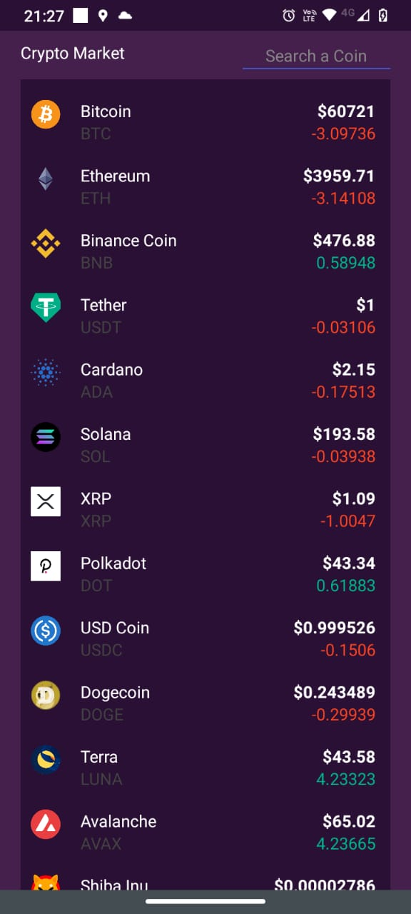

## Mobile App para visualizar variaciones en criptomonedas 

Esta aplicacion se realizo con react native, se uso axios para hacer las peticiones a una  API de criptomonedas llamada Coingecko.
Se estilizo con CSS

